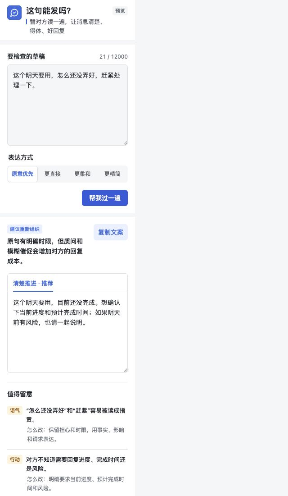

# Hit Send

**Before you send, let AI read the message as the recipient.**

[](https://github.com/BobbyYue/hit-send/actions/workflows/validate.yml)
[](CHANGELOG.md)
[](LICENSE)
[](https://agentskills.io/)

[中文说明](README.zh-CN.md) · [Install](#install) · [Use it](#use-it) · [Optional H5 interface](#optional-h5-interface) · [Latest release](https://github.com/BobbyYue/hit-send/releases/latest)

Hit Send is an open-source Agent Skill for short workplace messages. It checks whether a draft is clear, actionable, appropriately direct, and safe to send, then makes the smallest useful revision without changing the writer's facts, position, ownership, deadline, or voice.

It is designed for messages such as requests, reminders, status updates, disagreements, risk alerts, handoffs, short emails, and replies based on selected conversation context. It never sends the message for you.



## What it helps with

| Situation | What Hit Send checks |
| --- | --- |
| Ask for help or confirmation | Is the request, owner, expected response, and timing clear? |
| Remind or escalate | Does the message preserve urgency without vague pressure or accusation? |
| Disagree or correct | Are facts separated from assumptions about motive, attitude, or competence? |
| Report risk | Can the recipient see the current state, uncertainty, impact, and next decision? |
| Reply to a conversation | Is the reply grounded only in the selected context and supplied facts? |
| Express frustration | Is the legitimate concern visible without sarcasm or invented claims? |

The default is one recommended version. A second version appears only when it represents a genuinely different strategy, such as more direct versus more relationship-sensitive wording.

## Install

### Ask your agent

Send this instruction to an Agent Skills-compatible agent:

```text
Install Hit Send from https://github.com/BobbyYue/hit-send,
using the complete subdirectory skills/hit-send. Register it in the agent's normal
Skill directory, then confirm that SKILL.md and its references can be loaded.
Do not overwrite an existing installation without asking.
```

### Clone manually

```bash
git clone --depth 1 https://github.com/BobbyYue/hit-send.git
cp -R ./hit-send/skills/hit-send "<YOUR_AGENT_SKILLS_DIR>/hit-send"
```

Copy the complete folder, not only `SKILL.md`, and reload the agent if required by the host.

### Web or desktop import

Download the [latest release](https://github.com/BobbyYue/hit-send/releases/latest), extract it, and import `skills/hit-send` through the client's Skill interface. Do not import the repository root unless that client explicitly supports repository subpaths.

## Use it

Ask naturally:

```text
Use Hit Send to check this message before I send it:
这个明天要用，怎么还没弄好，赶紧处理一下。
```

A useful recommendation would make the request replyable without inventing a delivery promise:

```text
这个明天要用，想确认下目前进度和预计完成时间；如果明天前有风险，也请一起说明。
```

Other useful prompts:

```text
这句话会不会太冲？保留我的不同意见，但不要写得像在指责对方。
```

```text
根据我选中的两条消息起草回复。没有提供的进度、决定和承诺不要补。
```

```text
帮我把这条风险同步写清楚，重点检查影响、需要谁决定，以及下一次更新时间。
```

## What it protects

- **Meaning:** preserves facts, names, numbers, dates, scope, uncertainty, ownership, commitments, and the intended ask.
- **Voice:** keeps natural workplace language instead of turning every message into formal corporate prose.
- **Actionability:** makes unclear requests easier to answer without inventing deadlines or commitments.
- **Relationship safety:** keeps legitimate disagreement and emotion while removing sarcasm, mind-reading, and unsupported personal judgment.
- **User control:** returns a preview for explicit review or copying; it never posts, replies, or auto-sends.
- **Privacy boundary:** processes only text the user supplies or explicitly selects and does not require conversation-history access.

## Optional H5 interface

The repository includes an optional browser and Feishu/Lark H5 interface under [`apps/feishu-h5`](apps/feishu-h5). It supports:

- local browser use with an authenticated Codex CLI;
- a private model endpoint implementing the documented JSON contract;
- Feishu/Lark chat-box menu and message-action entry points;
- preview and copy without calling a message-send API.

Run a local preview:

```bash
cd apps/feishu-h5
npm test
HIT_SEND_PROVIDER=mock npm start
```

Open <http://127.0.0.1:8787>. See the [H5 deployment guide](apps/feishu-h5/README.md) for model and Feishu/Lark configuration.

## Development

Run the public-package checks:

```bash
python3 scripts/validate_repo.py
npm test --prefix apps/feishu-h5
python3 skills/hit-send/scripts/validate_response.py skills/hit-send/evals/valid-response.json
python3 skills/hit-send/scripts/validate_behavior_cases.py skills/hit-send/evals/behavior-cases.json
```

Repository layout:

```text
skills/hit-send/   installable Agent Skill
apps/feishu-h5/    optional browser and Feishu/Lark interface
docs/assets/       README preview assets
.github/workflows/ public CI checks
```

## Privacy and limitations

- Do not put credentials, private conversation exports, internal document links, or real sensitive messages in issues or test cases.
- Local Codex mode requires an installed and authenticated Codex CLI. Other hosts may use only the Skill folder.
- A local H5 URL is available only on that computer. Shared use requires an HTTPS deployment and an independently secured model endpoint.
- Hit Send improves message quality; it cannot determine facts or relationship context that the writer did not provide.

See [CONTRIBUTING.md](CONTRIBUTING.md) and [SECURITY.md](SECURITY.md). Licensed under [MIT](LICENSE).
